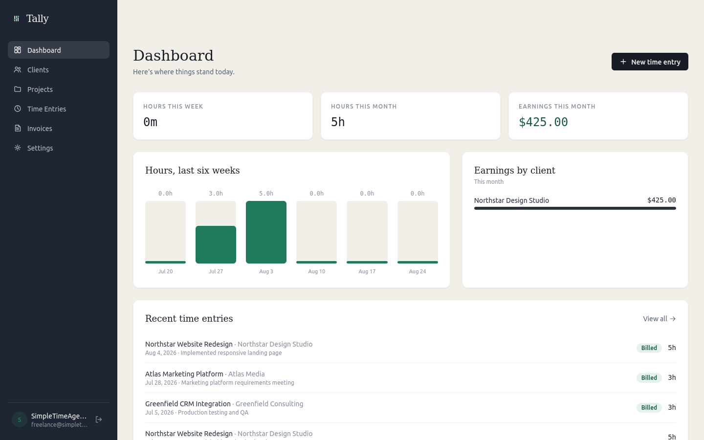
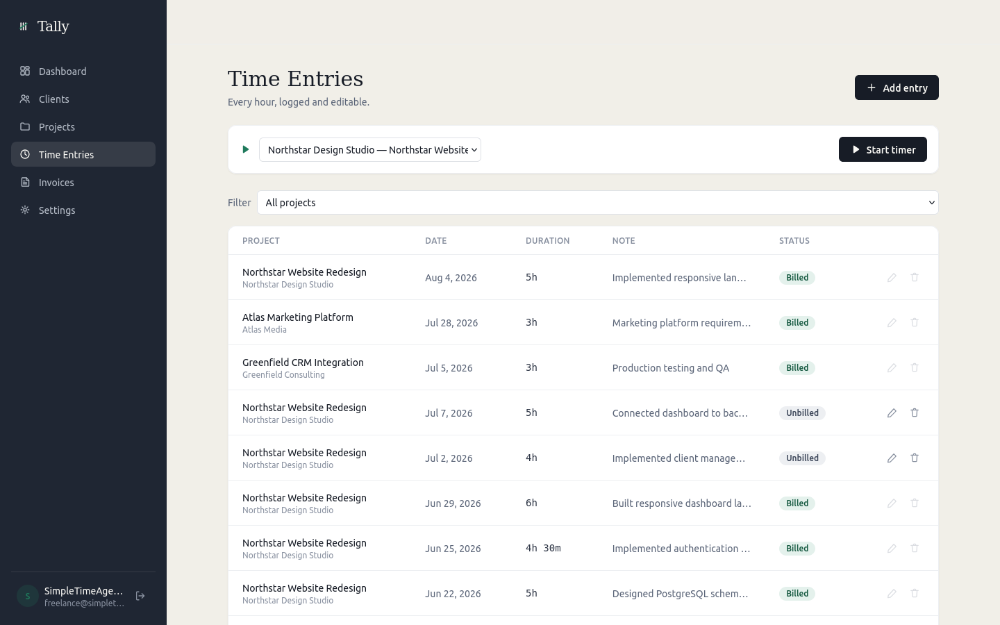
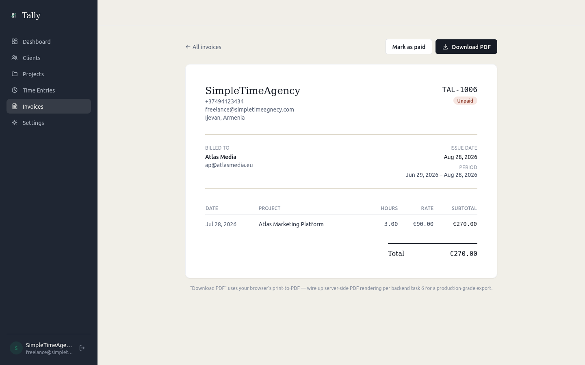

# Tally

<p align="center">
  <strong>Time tracking & invoicing for freelancers</strong>
</p>

<p align="center">
  Track your time, manage clients and projects, and create invoices from one place.
</p>

<!-- <p align="center">
  <a href="YOUR_LIVE_URL">Live Demo</a>
  ·
  <a href="YOUR_GITHUB_URL">Repository</a>
  ·
  <a href="YOUR_GITHUB_URL/issues">Issues</a>
</p> -->

<p align="center">

[](LICENSE)
[](https://nextjs.org/)
[](https://www.typescriptlang.org/)
[](https://supabase.com/)
[](https://www.postgresql.org/)

</p>

---

## 📸 Screenshots

### Dashboard

<p align="center">
  
</p>

### Time Tracking

<p align="center">
  
</p>

### Invoices

<p align="center">
  
</p>

---

## ✨ Features

- ⏱️ **Time tracking** — Track time spent on projects.
- 👥 **Client management** — Manage clients and their projects.
- 📁 **Project management** — Organize work by project.
- 🧾 **Invoicing** — Create and manage invoices.
- 🔐 **Authentication** — Secure user authentication.
- 🛡️ **Row Level Security** — Protect user-owned data at the database level.
- 📱 **Responsive UI** — Use Tally across different screen sizes.

> Tally is actively under development. Some features are still being migrated from browser-based persistence to the Supabase/PostgreSQL backend.

---

## 🛠️ Tech Stack

| Technology | Purpose |
|---|---|
| **Next.js** | Full-stack React framework |
| **React** | User interface |
| **TypeScript** | Type safety |
| **Supabase** | Authentication and backend services |
| **PostgreSQL** | Persistent application database |
| **Tailwind CSS** | Styling |
| **GitHub** | Source control and collaboration |

---

## 🏗️ Architecture

```text
                    TALLY
                      │
                      ▼
              ┌───────────────┐
              │   Next.js     │
              │   React UI    │
              └───────┬───────┘
                      │
                      ▼
              ┌───────────────┐
              │   Supabase    │
              │  Auth + API   │
              └───────┬───────┘
                      │
                      ▼
              ┌───────────────┐
              │  PostgreSQL   │
              │  Data + RLS   │
              └───────────────┘
````

For more details:

* [Architecture](docs/ARCHITECTURE.md)
* [Database](docs/DATABASE.md)
* [Development Guide](docs/DEVELOPMENT.md)

---

## 🚀 Getting Started

### Prerequisites

Make sure you have:

* Node.js
* npm
* A Supabase project

### 1. Clone the repository

```bash
git clone YOUR_GITHUB_URL
cd tally-app
```

### 2. Install dependencies

```bash
npm install
```

### 3. Configure environment variables

Create:

```text
.env.local
```

Add the required Supabase environment variables.

> Never commit `.env.local` or any secret keys.

### 4. Start the development server

```bash
npm run dev
```

Open:

```text
http://localhost:3000
```

---

## 📚 Documentation

| Document                              | Description                                 |
| ------------------------------------- | ------------------------------------------- |
| [Security](SECURITY.md)               | Security policy and vulnerability reporting |
| [Contributing](CONTRIBUTING.md)       | How to contribute to Tally                  |
| [Code of Conduct](CODE_OF_CONDUCT.md) | Community guidelines                        |
| [Architecture](docs/ARCHITECTURE.md)  | Application architecture                    |
| [Database](docs/DATABASE.md)          | PostgreSQL, Supabase and RLS                |
| [Development](docs/DEVELOPMENT.md)    | Development workflow                        |

---

## 🗺️ Project Status

Tally is actively under development.

The current development focus is moving the application toward a production-ready architecture:

```text
Browser-only persistence
        ↓
Supabase/PostgreSQL
        ↓
Database-enforced authorization
        ↓
Production-ready application
```

Planned development includes:

* [ ] Move remaining business data from `localStorage` to Supabase.
* [ ] Complete Supabase RLS policies.
* [ ] Implement transactional invoice generation.
* [ ] Add comprehensive validation.
* [ ] Improve automated testing.
* [ ] Add CI/CD.
* [ ] Improve production error handling.

See the project's [GitHub Issues](YOUR_GITHUB_URL/issues) for the current development roadmap.

---

## 🤝 Contributing

Contributions are welcome!

Before contributing, please read:

* [Contributing Guide](CONTRIBUTING.md)
* [Code of Conduct](CODE_OF_CONDUCT.md)

For security vulnerabilities, please follow the
[Security Policy](SECURITY.md) instead of opening a public issue.

---

## 📄 License

Tally is open source software licensed under the [MIT License](LICENSE).

---

<p align="center">
  Built with ❤️ using Next.js, TypeScript, Supabase and PostgreSQL.
</p>
